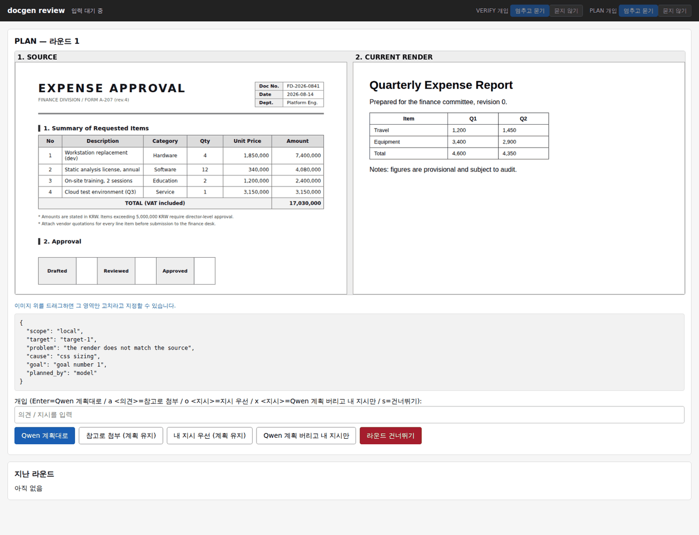
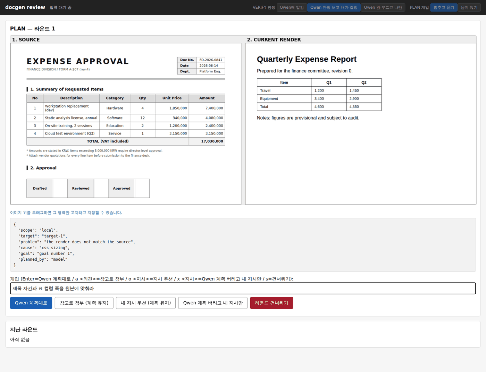
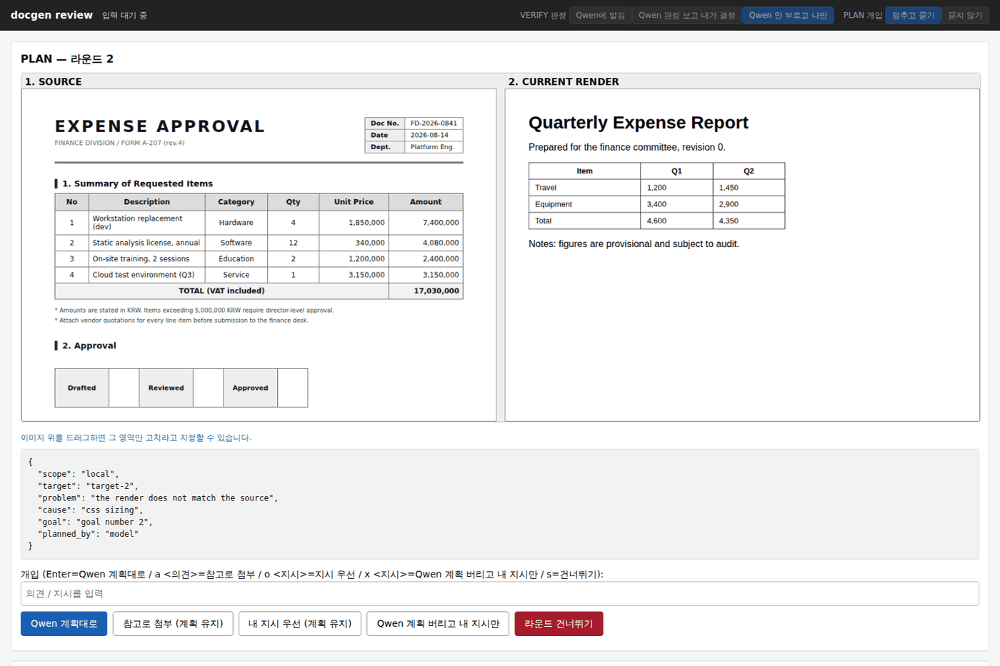
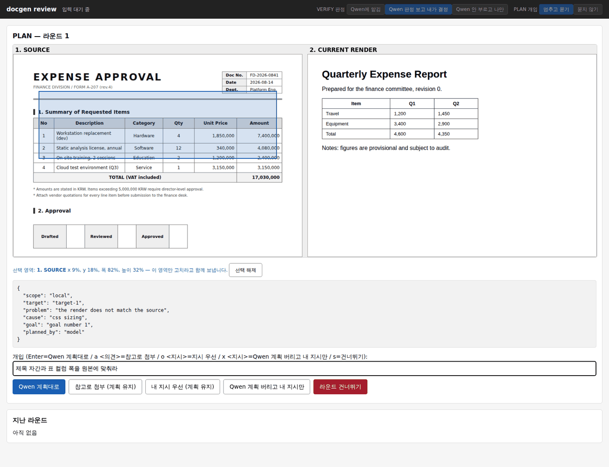
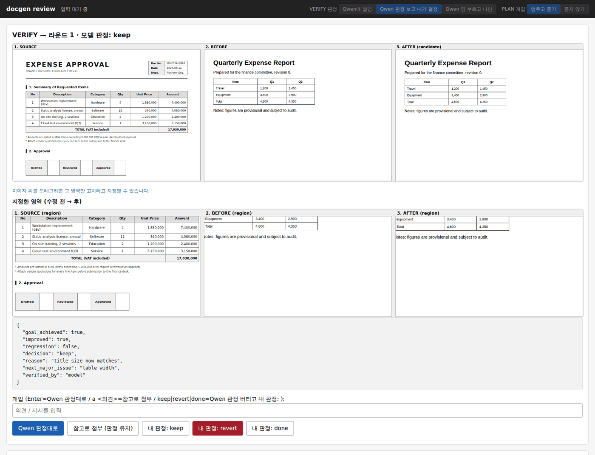
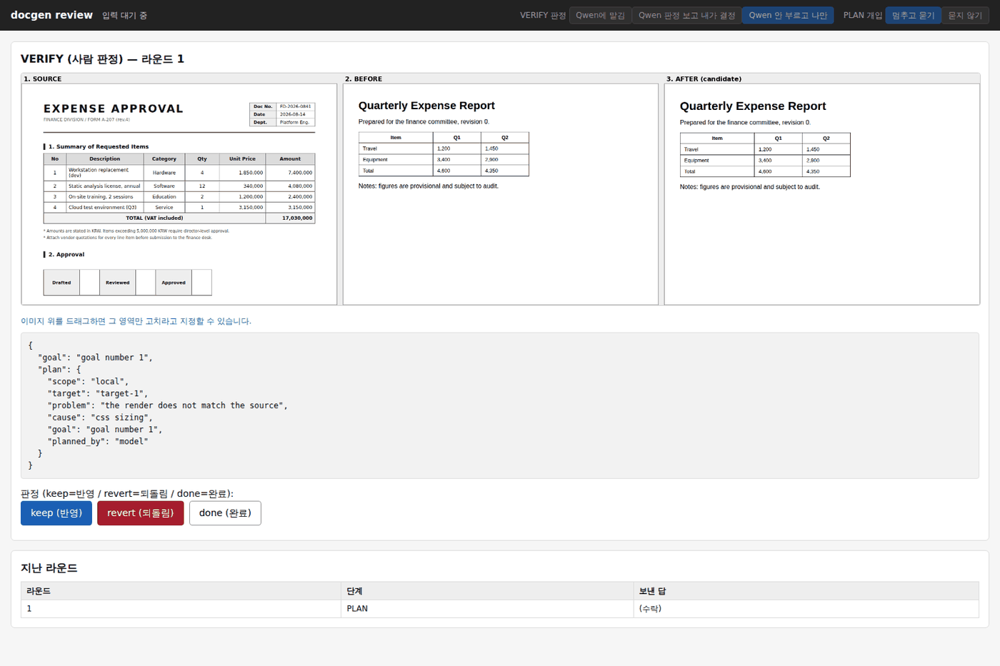
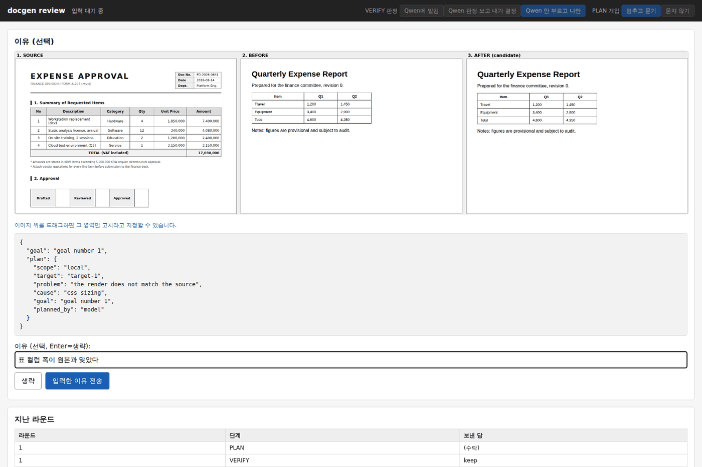
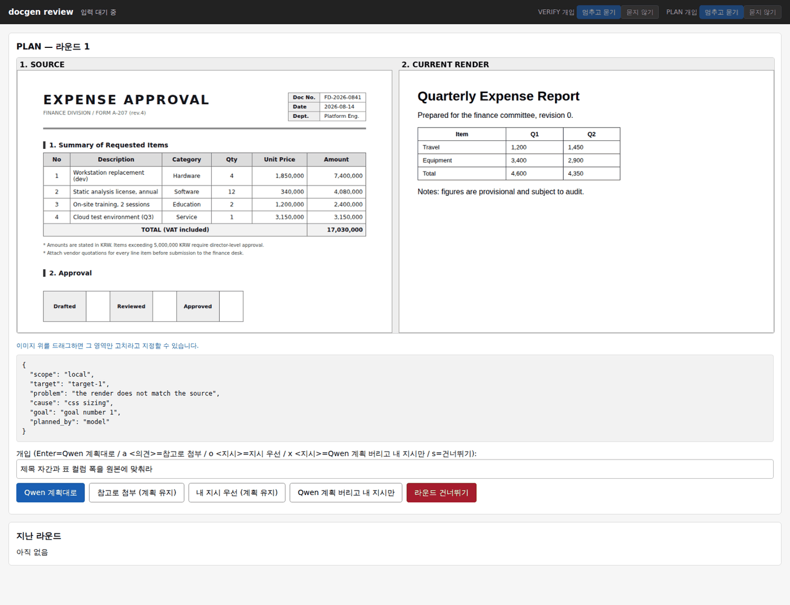

# docgen 검토 UI

문서 PNG를 HTML로 복원하는 루프에서 **사람이 끼어드는 화면**이다.

기본 흐름은 하나다.

> **Qwen이 낸 결과를 화면에서 먼저 읽고, 그대로 둘지 · 참고로 의견만 붙일지 ·
> Qwen 것을 버리고 내 결정을 쓸지 고른다.**

PLAN(무엇을 고칠지)과 VERIFY(고쳐졌는지) 두 단계가 같은 세 가지 선택을 준다.
셋 다 UI 버튼이고 CLI 옵션이 아니다.

| 하고 싶은 것 | PLAN 버튼 | VERIFY 버튼 |
| --- | --- | --- |
| Qwen 결과 그대로 | `Qwen 계획대로` | `Qwen 판정대로` |
| Qwen 결과 + 내 의견 | `참고로 첨부 (계획 유지)` | `참고로 첨부 (판정 유지)` |
| **Qwen 결과 버리고 내 결정** | `Qwen 계획 버리고 내 지시만` | `내 판정: keep/revert/done` |

버리면 Qwen의 원래 결과는 `model_plan` / `model_decision` 에 기록으로만 남고
`planned_by` / `verified_by` 가 `operator` 로 찍힌다.

* 실행: `python run.py build sample.png --ui`
* 표준 라이브러리만 쓴다. 서버 프레임워크를 새로 깔지 않는다.
* UI를 안 켜면 루프는 지금까지처럼 완전 자동으로 돈다.

구조와 확장 방법은 [ARCHITECTURE.md](ARCHITECTURE.md) 에 있다.

---

## 목차

* [시작하기](#시작하기)
* [시나리오 A — 지켜보기만](#시나리오-a--지켜보기만)
* [시나리오 B — 의견 첨언](#시나리오-b--의견-첨언)
* [시나리오 C — Qwen 계획 버리고 사람 지시대로](#시나리오-c--qwen-계획-버리고-사람-지시대로)
* [시나리오 D — 특정 영역만 고치기](#시나리오-d--특정-영역만-고치기)
* [시나리오 E — VERIFY를 사람이 직접](#시나리오-e--verify를-사람이-직접)
* [시나리오 F — 실행 중에 개입 방식 바꾸기](#시나리오-f--실행-중에-개입-방식-바꾸기)
* [시나리오 G — 다른 PC에서 접속](#시나리오-g--다른-pc에서-접속)
* [버튼 정리](#버튼-정리)
* [기록되는 것](#기록되는-것)
* [알아둘 제약](#알아둘-제약)

---

## 시작하기

```bash
python run.py build sample.png -o out/sample --ui
```

출력되는 주소를 브라우저로 열어둔다.

```
검토 UI: http://127.0.0.1:38995/  (브라우저에서 열어두세요)
```

`--ui` 를 켜면 **PLAN과 VERIFY 양쪽에서 사람 의견을 받는다.** 아무것도 입력하지
않고 수락만 누르면 모델 단독 실행과 결과가 같다.

한 라운드에서 화면은 두 번 뜬다.

```
PLAN 실행(모델) → [화면 ①] → ACTION → APPLY → RENDER → VERIFY 실행(모델) → [화면 ②] → keep/revert/done
```

라운드가 APPLY나 RENDER에서 거부되면 VERIFY까지 가지 않으므로 그 라운드는
화면 ①만 뜬다.

---

## 시나리오 A — 지켜보기만

모델이 얼마나 잘하는지 먼저 보고 싶을 때. 아무것도 입력하지 않고 **수락**만
누른다.



화면에 있는 것:

| 위치 | 내용 |
| --- | --- |
| 제목 | 지금 어느 단계 · 몇 번째 라운드인지 |
| 이미지 | 왼쪽 **원본**, 오른쪽 **현재 렌더** |
| JSON | 모델이 낸 PLAN 원문 (무엇이 문제고 무엇을 고치려는지) |
| 입력창 + 버튼 | 개입 방법 |
| 아래 카드 | 지난 라운드에 무엇을 보냈는지 |

`Qwen 계획대로` 를 누르면 그대로 ACTION으로 넘어간다. 이 방식으로 8라운드를 돌리면
`--ui` 없이 돌린 것과 동일한 결과가 나온다. **화면을 보는 값이 여기 있다** —
모델이 매 라운드 무엇을 보고 무엇을 고치려 하는지가 그대로 보인다.

---

## 시나리오 B — 의견 첨언

모델 계획은 괜찮은데 한 가지를 덧붙이고 싶을 때. 입력창에 적고
**`참고로 첨부 (계획 유지)`** 를 누른다.

* 모델 계획은 그대로 남는다.
* 적은 내용이 `plan.json` 의 `operator_note` 로 들어가고 ACTION이 함께 본다.
* VERIFY에서도 같은 방식으로 판정은 그대로 두고 의견만 붙일 수 있다. 그
  의견은 **다음 라운드 PLAN의 history로 실려 간다.**



입력창에 적고 **`참고로 첨부 (계획 유지)`** 를 누른다. 위 화면의 버튼 5개가
PLAN에서 할 수 있는 전부다 — 시나리오 C도 이 화면의 네 번째 버튼이다.



아래 카드에 무엇을 보냈는지 쌓인다. 영역까지 지정한 답에는 `[영역 지정]` 이
붙는다.

---

## 시나리오 C — Qwen 계획 버리고 사람 지시대로

모델이 엉뚱한 걸 집었을 때. **CLI 옵션이 아니라 PLAN 화면의 버튼이다.**
([시나리오 B 화면](images/02-plan-intervene.png)의 네 번째 버튼)

**화면에서 Qwen 계획을 읽은 다음** 지시를 적고
**`Qwen 계획 버리고 내 지시만`** 을 누른다.

* 모델 계획을 **버린다.** ACTION은 사람 지시만 목표로 본다.
* 원래 계획은 `plan.json` 의 `model_plan` 에 기록만 남는다. 프롬프트에
  "`model_plan` 은 참고용이고 실행하지 말라"가 들어간다.
* `planned_by` 가 `operator` 로 기록된다.

`계획 교체` 와의 차이: `계획 교체` 는 모델 계획을 남긴 채 사람 지시를 우선하게
하고, 이 버튼은 모델 계획을 아예 치운다.

---

## 시나리오 D — 특정 영역만 고치기

"이 표만 원본에 맞춰라" 처럼 한 부분을 지목할 때. **이미지 위를 드래그**한다.



드래그하면 아래에 선택 결과가 뜬다.

```
선택 영역: 1. SOURCE  x 9%, y 18%, 폭 82%, 높이 32%  [선택 해제]
```

그 다음 지시를 적고 아무 버튼(참고 첨부 / 지시 우선 / 내 지시만)을 누르면 영역이 함께
전송된다. 그 라운드에서 벌어지는 일:

1. `plan.json` 에 `operator_region` (비율 좌표 0~1)이 저장된다.
2. **ACTION이 받는 이미지가 4장이 된다** — 원본 전체, 현재 렌더 전체, 그리고
   그 영역을 확대한 crop 2장(원본 / 현재 렌더).
3. 프롬프트에 좌표와 함께 "이 crop이 보여주는 것만 고치고 나머지는 건드리지
   말라"가 들어간다.
4. VERIFY 화면에 **지정한 영역 확대 비교**가 추가로 뜬다.



위가 전체 페이지(원본 · 수정 전 · 수정 후), 아래가 **지정한 영역만 확대**한
것이다. 전체만 보면 작은 영역이 고쳐졌는지 알 수 없어서 두 장을 같이 준다.

* 위 = 다른 곳이 망가지지 않았나
* 아래 = 지목한 부분이 실제로 고쳐졌나

좌표를 비율로 저장하는 이유는 **원본 스캔이 2480px이고 렌더가 800px이어도 같은
영역을 가리켜야** 하기 때문이다.

---

## 시나리오 E — VERIFY를 사람이 직접

판정을 사람이 하는 방법은 두 가지다.

**① Qwen 판정을 읽고 내 판정으로 갈아치우기 — 이게 기본이다.** VERIFY 화면의
`내 판정: keep / revert / done` 버튼. Qwen이 뭐라고 판정했는지 화면에서 먼저
보고 바꾼다. `verified_by` 가 `operator` 로 찍히고 Qwen의 원래 판정은
`model_decision` 에 남는다. 별도 옵션이 필요 없다 — `--ui` 만 켜면 된다.

**② Qwen에게 아예 묻지 않기** — 모델 호출을 건너뛴다. 가장 비싼 호출(이미지
3장 + thinking ON)이 사라지지만 **비교할 Qwen 의견도 없다.** 실행할 때 지정해도
되고, [시나리오 F](#시나리오-f--실행-중에-개입-방식-바꾸기) 처럼 **실행 중에
화면에서 바꿔도 된다.**

```bash
python run.py build sample.png --ui --verify human
```



판정 버튼만 있고 입력창이 없다. 고르면 이유와 다음 이슈를 차례로 묻는다.



### 판정이 다음 라운드로 전달되는 것

**사람이 적은 이유도 들어간다.** keep이든 revert든 마찬가지다. 무엇이 어떻게
실려 가는지는 이렇다.

| 상황 | 다음 PLAN이 보는 줄 |
| --- | --- |
| 사람이 판정 + 이유 입력 | `-> keep [operator] why: 표 폭은 맞았지만 여백이 남았다; next: 제목 자간` |
| 사람이 판정 + 이유 생략 | `-> keep [operator] next: 제목 자간` |
| Qwen 판정을 사람이 교체 | `-> revert [operator] why: 표가 더 어긋났다; next: table width` |
| Qwen 판정 유지 + 사람 첨언 | `-> keep [model+operator] operator: 우측 정렬 남음` |
| Qwen 단독 판정 (revert) | `-> revert [model] why: table became too wide; next: header rule` |
| Qwen 단독 판정 (keep) | `-> keep [model] next: notes font` |

읽는 규칙 세 가지:

* **`why:` 는 항상 판정한 쪽의 이유다.** 대괄호가 `[operator]` 면 `why:` 도
  사람이 적은 것이다. 사람이 Qwen 판정을 교체했을 때 버려진 Qwen의 근거는
  여기 오지 않는다(`verify.json` 의 `model_decision` 에 기록으로만 남는다).
* **`why:` 는 revert 일 때 항상, keep 일 때는 사람이 이유를 적었을 때만** 붙는다.
  되돌린 이유는 같은 시도 반복을 막으니 항상 필요하고, 성공 사유는 사람이
  일부러 적었을 때만 신호가 된다.
* **`operator:` 는 Qwen 판정이 유지된 채 사람이 의견만 붙였을 때만** 나온다.
  사람이 판정한 경우 그 사람 말은 이미 `why:` 에 있다.

이유를 비워두면 아무것도 실리지 않는다. 자리 채우기용 문구가 프롬프트에
들어가는 일은 없다.

되돌려지거나 적용 실패한 접근은 최근 3라운드 창을 넘어서도 **실행 내내 별도
목록으로 유지**되어 PLAN에 전달된다. 오래전에 실패한 방식을 다시 꺼내는 것을
막는다. `summary.json` 의 `failed_attempts` 에서 볼 수 있다.

VERIFY 모델 호출(이미지 3장 + thinking ON)이 사라지므로 가장 비싼 호출이
빠진다. 대신 매 라운드 사람이 붙어 있어야 한다.

---

## 시나리오 F — 실행 중에 개입 방식 바꾸기

처음에는 지켜보다가 "이제 내가 판정하겠다"로 바꾸거나, 반대로 "나머지는 알아서
돌려라"로 빠질 때. **다시 실행할 필요 없이 화면 오른쪽 위에서 바꾼다.**



| 컨트롤 | 선택지 | 뜻 |
| --- | --- | --- |
| VERIFY 판정 | `Qwen에 맡김` | 사람에게 묻지 않고 Qwen 판정대로 |
| | `Qwen 판정 보고 내가 결정` | **기본.** Qwen이 판정하고 사람이 읽고 갈아치울 수 있음 |
| | `Qwen 안 부르고 나만` | Qwen VERIFY 호출을 건너뛰고 사람만 판정 |
| PLAN 개입 | `멈추고 묻기` / `묻지 않기` | PLAN에서 멈출지 |

바꾸면 **다음 PLAN·VERIFY부터** 적용된다. 진행 중인 질문에는 영향이 없다.
현재 어떤 설정인지는 파란색으로 표시된다.

둘 다 끄면(`모델만` + `안 받기`) 그 시점부터 완전 자동으로 돈다. 브라우저는
그냥 진행 상황을 보는 창이 된다.

`summary.json` 에는 시작할 때의 설정(`verify_mode`)과 끝날 때의 설정
(`verify_mode_final`)이 모두 남는다.

## 시나리오 G — 다른 PC에서 접속

파이프라인은 GPU 서버에서 돌고, 화면은 윈도우에서 볼 때.

```bash
python run.py build sample.png --ui --ui-host 0.0.0.0 --ui-port 8900
```

출력되는 주소는 `0.0.0.0` 이 아니라 **실제 접속 가능한 IP**로 찍힌다.

```
검토 UI: http://10.167.129.230:8900/  (브라우저에서 열어두세요)
  주의: 이 주소는 같은 네트워크의 다른 PC에서도 열립니다. 인증이 없으니 사내망에서만 쓰세요
```

윈도우 브라우저에 그 주소를 넣으면 된다. **인증이 없어서** 기본값은 localhost
바인딩이고, `--ui-host` 를 명시해야 열린다.

---

## 버튼 정리

### PLAN 화면

| 버튼 | 결과 | 남는 것 |
| --- | --- | --- |
| `Qwen 계획대로` | 모델 계획대로 진행 | `planned_by: model` |
| `참고로 첨부 (계획 유지)` | 계획 유지 + 참고 의견 | `operator_note` |
| `내 지시 우선 (계획 유지)` | 계획은 남기고 사람 지시를 우선 | `operator_instruction` |
| `Qwen 계획 버리고 내 지시만` | 계획을 버림 | `planned_by: operator`, `model_plan` |
| 라운드 건너뛰기 | 이 라운드를 통째로 넘김 | `decision: skipped` |

헤더의 컨트롤은 언제든 눌러 개입 방식 자체를 바꾼다
([시나리오 F](#시나리오-f--실행-중에-개입-방식-바꾸기)).

### VERIFY 화면 (모델이 판정한 경우)

| 버튼 | 결과 | 남는 것 |
| --- | --- | --- |
| `Qwen 판정대로` | 모델 판정대로 | `verified_by: model` |
| `참고로 첨부 (판정 유지)` | 판정 유지 + 참고 의견 | `verified_by: model+operator` |
| `내 판정: keep/revert/done` | Qwen 판정을 버리고 사람 판정 | `verified_by: operator`, `model_decision` |

### VERIFY 화면 (`--verify human`)

| 버튼 | 결과 |
| --- | --- |
| keep (반영) | 이 수정을 채택 |
| revert (되돌림) | 이전 HTML로 복원 |
| done (완료) | 충분히 닮았다고 보고 종료 |

입력창이 있는 화면에서는 **Enter** 로도 보낼 수 있다.

---

## 기록되는 것

사람이 개입한 것과 모델이 스스로 한 것은 **반드시 따로 남는다.** 안 그러면
"Qwen이 이 작업을 할 수 있나"라는 판단이 오염된다.

| 파일 | 필드 |
| --- | --- |
| `rounds/rNN/plan.json` | `planned_by`, `operator_note`, `operator_instruction`, `operator_region`, `model_plan` |
| `rounds/rNN/verify.json` | `verified_by` (`model` / `model+operator`=참고 의견만 / `operator`=사람이 판정), `model_decision`, `operator_override`, `operator_note` |
| `summary.json` | `verify_mode`(시작 설정), `verify_mode_final`(종료 시점 설정), `operator_interventions`, `operator_rounds`, `skipped`, 라운드별 `operator` |

모델 단독 성능을 보려면 `--ui` 없이 돌린 실행을 보고, 개입이 섞인 실행에서는
`operator: true` 라운드를 빼고 읽는다.

라운드 폴더에 함께 남는 이미지:

| 파일 | 언제 |
| --- | --- |
| `plan_view.png` | 사람이 개입하는 실행 (원본 · 현재 렌더) |
| `compare.png` | 항상 (원본 · 수정 전 · 수정 후) |
| `compare_region.png` | 영역을 지정한 라운드만 |

---

## 알아둘 제약

정직하게 적어둔다.

* **영역 지정은 요청이지 강제가 아니다.** APPLY가 patch가 그 영역 안을
  건드렸는지 검증하지 않는다. 모델이 영역 밖을 고쳐도 통과한다.
* **영역 좌표는 "같은 상대 위치"지 "같은 내용"이 아니다.** 렌더의 전체 높이가
  원본과 많이 다른 초기 라운드에서는 같은 비율이 다른 내용을 가리킬 수 있다.
  모델은 전체 이미지도 함께 받으므로 오해로 이어지진 않지만, 확대 crop이
  엉뚱해 보이면 이 이유다.
* **영역은 한 번에 하나.** 그 라운드에만 유효하고 다음 라운드는 다시 지정한다.
* **지난 라운드로 돌아가 재검토할 수 없다.** 아래 카드는 무엇을 보냈는지만
  보여준다.
* **동시 접속에 잠금이 없다.** 두 명이 열면 먼저 누른 답이 먹는다.
* **터치는 안 된다.** 드래그가 마우스 이벤트 기반이라 모바일에서는 영역 지정이
  동작하지 않는다.
* **실행 시작·중단은 CLI에서** 한다. UI에는 시작 버튼도 정지 버튼도 없다.
  개입 방식(판정 주체, PLAN 개입 여부)은 실행 중에 바꿀 수 있지만, 라운드 수나
  대상 문서 같은 것은 바꿀 수 없다.
* **인증이 없다.** `--ui-host` 로 열 때는 사내망 안이라는 전제가 필요하다.
* 답이 `--ui-timeout`(기본 1800초) 안에 오지 않으면 입력 없음으로 처리한다.
  사람이 단독 판정하는 모드였다면 `revert` 가 된다 — 판정되지 않은 수정을
  채택하는 일은 없다.
